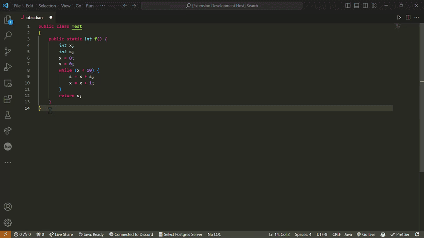

# Visual Studio Code Plug-In
This plug-in transforms highlighted Java code into the obfuscated form as shown in the GIF below.



## Installation
First, clone this repository using your terminal with the following command:
```
git clone https://github.com/obsidian-java/obsidian.git
```

Next, ensure you have the following:
- Scala and SBT
- Node.js

You may check that you have these by running the following:
```
node -v
```
```
npm -v
```
```
sbt -version
```

Run `sbt` in the base directory of Obsidian. This will start the SBT shell. 

Within the shell, run `install`. This will install the npm dependencies and compile the project to `out/extension.js`. 

Open the `extension.js` file in the `out` folder in VSCode and press F5. If prompted, select the Visual Studio Code Extension Development Host. A new window with the Extension Development Host should appear. 

Open your Java file in this window and select the code to be obfuscated. Right-click and select "Command Palette" and search for the "Obsidian" command and select it. The code should then transform into the obfuscated version. 